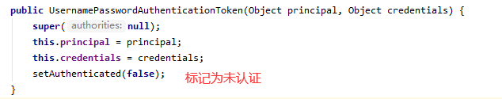
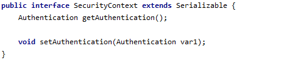
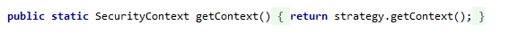

# Spring Security

用户密码登录+身份验证

## Pom文件

spring security的核心依赖 

```xml
<dependency>    
    <groupId>org.springframework.boot</groupId>    
    <artifactId>spring-boot-starter-security</artifactId>
</dependency>
```


测试可以将用户存在内存中，如果要从数据库验证，则还需要引入连接数据库的依赖

Mysql

```xml
<dependency>   
    <groupId>mysql</groupId>    
    <artifactId>mysql-connector-java</artifactId>   
    <version>5.1.47</version>
</dependency>
```

连接池 druid

```xml
<dependency>    
    <groupId>com.alibaba</groupId>    
    <artifactId>druid-spring-boot-starter</artifactId>    
    <version>1.1.21</version>
</dependency>
```

Mybatis plus

```xml
<dependency>    
    <groupId>com.baomidou</groupId>    
    <artifactId>mybatis-plus-boot-starter</artifactId>    
    <version>3.2.0</version>
</dependency>
```


## yml配置

配置好端口以及数据源

```yml
spring:  
	datasource:   
		type: com.alibaba.druid.pool.DruidDataSource    
		url: jdbc:mysql://localhost:3306/数据库名(cj版本还要配置时区等信息) 
		username: 用户名    
		password: 密码
		driver-class-name: com.mysql.jdbc.Driver
```


## 主启动，mybatis的mapper等略


## security配置类

需要继承

```java
org.springframework.security.config.annotation.web.configuration.WebSecurityConfigurerAdapter
    
```

并重写其中两个同名的configure方法

```java
protected void configure(HttpSecurity http) throws Exception
```

```java
protected void configure(HttpSecurity http) throws Exception {        			             http.authorizeRequests()                
    		.antMatchers("/","home").permitAll()                							.antMatchers("/hello")                
    		.hasAnyAuthority("ROLE_USER") 
    		//.hasRole("USER") 
    		.anyRequest().permitAll()                
    		.and()                
    		.formLogin();
            //.loginPage("/login").permitAll()
 			//.usernameParameter("username").passwordParameter("password")
            // .and()
			//.logout().logoutUrl("/logout").logoutSuccessUrl("/login");    
}
```

以HttpSecurity为参数的是配置访问的路径的权限以及登录，注销页面的路径，部分参数使用如下


```java
protected void configure(AuthenticationManagerBuilder auth) throws Exception {   
}
```

该方法是配置身份如何验证

```java
auth.jdbcAuthentication()   .passwordEncoder(encoder) 
							.dataSource(dataSource)        					                                   .usersByUsernameQuery("select username,password ,1 from user where username =?")       
                            .authoritiesByUsernameQuery("select username,role from user where username=?");
```

该方式是直接编写sql语句，数据源为yml中的数据源，encoder是密码加密器，使用的是BCryptPasswordEncoder, 这种方式实体类不需要继承UserDetials


第二种是给权限管理传入两个参数，数据的服务层和权限提供者

```java
auth.userDetailsService(userService);
auth.authenticationProvider(myAuthenticationProvider);
```

第一个参数userService是继承了UserDetialsService，并重写如下方法

```java
public UserDetails loadUserByUsername(String s) throws UsernameNotFoundException
```

在进行验证的时候，还是先调用WebSecurityConfigurAdapter类如下方法

```java
public UserDetails loadUserByUsername(String username)
```

该方法最后会调用重写的loadUserByUsername方法，该方法只要返回验证的实体类对象，怎么返回自己定义，例如查询数据库后返回

```java
public UserDetails loadUserByUsername(String s) throws UsernameNotFoundException {   	 User user=userMapper.getUserByName(s);    	                                         if (user==null){       
    		throw new UsernameNotFoundException("用户不存在");    
	  }                                                                                   return user;
}
```


第二个参数是myAuthenticationProvider继承了AuthenticationProvider的自定义验证类

实现以下方法，使用默认的即可，不需要改变

```java
public boolean supports(Class<?> authentication) {
        return authentication.equals(
                UsernamePasswordAuthenticationToken.class);
    }
```

重写以下方法

public Authentication authenticate(Authentication authentication) throws AuthenticationException

例如开启不需要密码的账户

```java
public Authentication authenticate(Authentication authentication) throws AuthenticationException {
        String name = authentication.getName();
        String password = authentication.getCredentials().toString();
    
    //利用yDie用户名登录，不管密码是什么都可以，伪装成admin用户
    if (name.equals("yDie")) {
        Collection<GrantedAuthority> authorityCollection = new ArrayList<>();
        authorityCollection.add(new SimpleGrantedAuthority("ROLE_ADMIN"));
        authorityCollection.add(new SimpleGrantedAuthority("ROLE_USER"));
        return new UsernamePasswordAuthenticationToken(
                "admin", password, authorityCollection);
    } else {
        return null;
    }
}
```
如果用户名是yDie则不需要进行密码验证


<font color="red">**以上方式密码均需要加密，默认是BCryptPasswordEncoder类来加密，如数据库存储的密码是未进行加密的，则会报错 Bad credentials** </font>


## 


## 几个重要的接口


第二个：PasswordEncoder

这个接口是规定数据怎么加密，用于返回User对象里面密码加密，最常用的实现类是BCryptPasswordEncoder


## 认证的方式


1.通过配置文件yml


2.配置类

就是继承WebSecurityConfigurerAdapter并重写

```java
protected void configure(AuthenticationManagerBuilder auth) throws Exception 
```

这个方法就是设置认证的

<font color="red">注意要添加PasswordEncoder的Bean</font>


3.自定义实现类设置

第一步 	创建配置类，设置使用哪个userDetailsService实现类

第二步	编写实现类，返回User对象，User对象有用户名密码和操作权限


还是上面配置类的的那个方法

设置userDetailsService


自定义的userDetailsService就可以配置用户名和密码


整合mybatis 连接数据库

yml配置数据源以及mybatis的mapper...略


在MyUserDetailsService中进行数据库交互，进行认证(此时密码还是没有加密的)


## 自定义的用户登录以及权限方案

还是WebSecurityConfigurerAdapter的继承类，重写以下方法

```java
protected void configure(HttpSecurity http) throws Exception 
```


注意hasRole是要加ROLE_前缀，hasAuthority不需要

  


设置自定义的异常页面，没有权限

```java
http.exceptionHandling().accessDeniedPage("/unauth");
```


## 注解使用

**@Secured**		用户具有某个角色，可以访问方法，需要加上ROLE_前缀

使用方法：

1.在主启动或者配置类上面使用@EnableGlobalMethodSecurity(securedEnabled=true)

2.在控制层的方法上面加上@Secured注解


**@PreAuthorize**	进入方法前的权限验证

@PreAuthorize可以将登录用户的roles、permissions参数传到方法中

使用方法：

1.在主启动或者配置类上面使用@EnableGlobalMethodSecurity(prePostEnabled=true)

2.在控制层的方法上面加上@PreAuthorize注解


**@PostAuthorize**	方法执行后的权限验证，一个验证返回值的情况

@PreAuthorize可以将登录用户的roles、permissions参数传到方法中

使用方法：

和preAuthorize类似，只是将控制层的preAuthorize改为postAuthorize

1.在主启动或者配置类上面使用@EnableGlobalMethodSecurity(prePostEnabled=true)

2.在控制层的方法上面加上@postAuthorize注解


**@PostFilter**	权限验证后对数据进行过滤，留下用户名为xxx的数据

表达式中的filterObject引用的方法返回值List中的某一个元素


**@PreFilter**	进入控制器之前对数据进行过滤，也就是传过来的参数进行过滤


**退出登录**

  


## **自动登录**


1. 建表语句 **JdbcTokenRepositoryImpl**类中 CREATE_TABLE_SQL属性值

2. 配置类，注入数据源，配置操作数据库对象

   

3. ```java
   WebSecurityConfigurerAdapter	继承类中操作
   protected void configure(HttpSecurity http) throws Exception
   ```

  


4. 设置复选框

   该标签name属性不可改变，必须为remember-me


**跨站请求伪造csrf**

**CsrfFilter.class查看源码**


还是在WebSecurityConfigurerAdapter继承类中操作

spring security默认是开启的，使用下面语句关闭

```java
http.csrf().disable();
```


在登录的form表单中添加以下隐藏项


将token存到session中，每次请求将请求所带的token与session中的比较，相同则允许访问，不同则不允许访问


微服务权限认证

  


## 案例实战

1	创建父工程	acl_parent	:	管理依赖版本

2	在父工程创建子模块	

​	（1）common

​		*service_base	:	工具类,例如连接数据库

​		*spring_security	:	权限配置

​	（2）infrastructure

​		*api_geteway

​	（3）service

​		*service_acl		权限管理微服务模块

​		


1. 启动redis		默认端口6379	

2. 启动nacos      默认端口8848    默认页面   ip:8848/nacos   nacos/nacos

3. 编写common工具类                包括异常处理，数据库连接

   service_base微服务

   

    编写springSecurity认证授权工具类和处理器

   spring_security微服务


## 总流程图


## 认证过程


## 源码分析

### 认证过滤器

1. UsernamePasswordAuthenticationFilter

   会拦截所有请求进行认证，这个请求必须是post请求

   该类继承了AbstractAuthenticationProcessingFilter

   在认证的过程会先调用父类AbstractAuthenticationProcessingFilter的doFilter方法

   

   上述代码解释

   第一步


第二，三步


第四步（成功）


 第四步（失败，抛出异常） 


2.第二步中进行认证的过程

```java
public Authentication attemptAuthentication(HttpServletRequest request, HttpServletResponse response) throws AuthenticationException 
```


3 根据获取到的信息构建对象的过程

  


4调用认证方法的过程

```java
return this.getAuthenticationManager().authenticate(authRequest);
```

this.getAuthenticationManager()返回的是一个AuthenticationManeger对象，AuthenticationManager是一个接口，它有一个实现类ProviderManager


5.上述过程中认证成功与失败的源码

```java
protected void successfulAuthentication(HttpServletRequest request, HttpServletResponse response, FilterChain chain, Authentication authResult) throws IOException, ServletException {    
    if (this.logger.isDebugEnabled()) {       
        this.logger.debug("Authentication success. Updating SecurityContextHolder to contain: " + authResult);    
    }    
    SecurityContextHolder.getContext().setAuthentication(authResult);    this.rememberMeServices.loginSuccess(request, response, authResult);    
    if (this.eventPublisher != null) {        
        this.eventPublisher.publishEvent(
            new InteractiveAuthenticationSuccessEvent(authResult, this.getClass()));    
    }    
    this.successHandler.onAuthenticationSuccess(request, response, authResult);
}
```


使用SecurityContextHolder.getContext() 得到security上下文，在将认证信息放到上下文中，这个上下文在程序的任何地方都可以调用

this.successHandler.onAuthenticationSuccess(request, response, authResult);

调用认证成功的的处理器


### 权限过滤器

1. ExceptionTranslationFilter

   这个过滤器是处理异常的，不需要自己配置，它的作用就是捕获抛出的异常，在认证失败的时候会抛出异常，包括没有权限的异常，都会被这个过滤器捕获

过滤器的主要方法还是doFilter方法


第二个过滤器FilterSecurityInterceptor

这个过滤器是过滤链中的最后一个过滤器，根据资源权限判断当前请求能否访问这个权限

  


根据资源配置判断当前请求是否有资源的访问权限


这个过滤器需要在spring mvc的dispatcherServlet之前进行配置，因为该请求还需要经过spring mvc的一系列操作


### 认证对象信息与Session绑定

1. 上文中已分析在认证成功的时候将认证信息放到了security的上下文中
2. 查看SecurityContext对象



这个类和它的子类SecurityContextImpl的作用就是对Authentication对象进行封装


```java
SecurityContextHolder类的初始化方法
```

​	

  

把操作和当前线程进行绑定


后面获取的时候就可以从securityContext获取



如果有的话就直接返回，没有的话就创建一个新的Context返回（单例模式）


绑定之后还需要经过一个过滤器，这个过滤器是SecurityContextPersistenceFilter

这个过滤器是所有过滤器最前面的一个过滤器，它的责任就是将认证信息对象authentication和session进行绑定


当请求来的时候，判断session中是否有这个authentication信息，有的话直接放进去，没有的话就将authentication取出来放进去，再进行后面的操作


```java
HttpRequestResponseHolder holder = new HttpRequestResponseHolder(request, response);SecurityContext contextBeforeChainExecution = this.repo.loadContext(holder);
```

当请求来的时候判断有没有session中有没有securityContext对象，如果有的话就直接从session取出返回，如果没有的话则建一个新的securityContext对象


```java
SecurityContextHolder.setContext(contextBeforeChainExecution);
```

将securityContext放到SecurityContextHolder中


```java
chain.doFilter(holder.getRequest(), holder.getResponse());
```

进入到下一个过滤器

